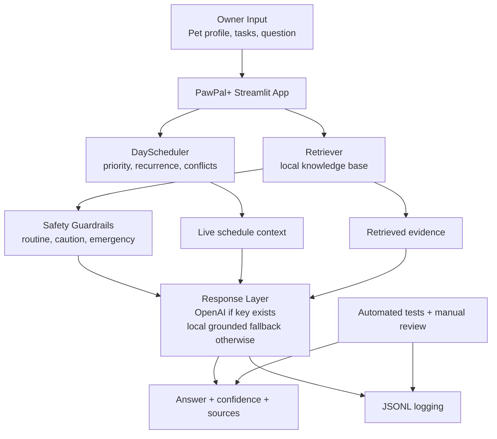

# PawPal+ Applied AI System

PawPal+ is a retrieval-assisted pet-care planning system built with Python and Streamlit. It combines a daily scheduler, a local pet-care knowledge base, safety guardrails, confidence scoring, and optional OpenAI-powered answer synthesis to help pet owners turn care questions into practical next steps.

This repo extends my original **Module 2 project: PawPal+ Smart Daily Pet Care Planner**. The original version focused on structured pet-care scheduling with task priorities, recurrence, sorting, filtering, and conflict detection. This final version keeps that planner and expands it into an applied AI system that can retrieve relevant care guidance, explain suggestions, log its behavior, and escalate risky questions instead of answering them casually.

## Why it matters

Pet owners often need two things at once: a plan for the day and help reasoning through routine care questions. PawPal+ connects those two workflows so advice is not just generated in isolation. The system can ground an answer in retrieved notes, reflect the live task schedule, and surface when a question should be handled by a veterinarian instead.

## Core features

- Daily planner for owner and pet profiles, task entry, priority scheduling, recurrence, sorting, filtering, and conflict detection
- Retrieval-augmented advice using a local knowledge base in `knowledge_base/`
- Safety guardrails that route emergency-style questions away from casual chatbot behavior
- Confidence scoring based on retrieval strength and risk level
- JSONL interaction logging for traceability and evaluation
- Optional OpenAI response synthesis when `OPENAI_API_KEY` is available
- Automated tests for scheduler logic and AI reliability behaviors

## Architecture Overview

The system has five main components:

1. `Streamlit UI` collects pet info, care tasks, and user questions.
2. `Scheduler Engine` organizes care tasks and exposes live pet context.
3. `Retriever` searches the local knowledge base for relevant pet-care notes.
4. `Safety + Response Layer` scores risk, decides whether to escalate, and generates an answer using either local grounded logic or an OpenAI model.
5. `Evaluation + Logs` records each interaction and validates expected behavior with tests.

See the system diagram in [diagram.md](/Users/juanespitia/Downloads/applied-ai-system-project/diagram.md).

## System Diagram



## Project Structure

```text
app.py                    Streamlit app
pawpal_system.py          Core scheduling classes
pawpal_ai.py              Retrieval, guardrails, confidence scoring, logging
evaluate_pawpal_ai.py     Small evaluation runner
knowledge_base/           Local retrieval documents
tests/                    Automated tests
diagram.md                Mermaid system diagram
reflection.md             Final reflection and ethics notes
```

## Setup Instructions

### 1. Create and activate a virtual environment

```bash
python -m venv .venv
source .venv/bin/activate
```

On Windows:

```bash
.venv\Scripts\activate
```

### 2. Install dependencies

```bash
pip install -r requirements.txt
```

### 3. Optional: add an API key

PawPal+ works without an API key by using a local grounded fallback.  
If you want OpenAI to synthesize the final response text, create a `.env` file or export:

```bash
export OPENAI_API_KEY=your_key_here
```

### 4. Run the app

```bash
streamlit run app.py
```

### 5. Run the terminal demo

```bash
python main.py
```

### 6. Run tests

```bash
python -m pytest -q
```

### 7. Run the evaluation script

```bash
python evaluate_pawpal_ai.py
```

## Sample Interactions

### Example 1: Routine planning question

**Input**

```text
How can I keep Mochi consistent with feeding and exercise on busy days?
```

**Output shape**

```text
For Mochi, here is a grounded care suggestion based on the PawPal+ knowledge base.

Consistent feeding, water refresh, exercise, and observation are the foundation of routine pet care...

Why: The strongest match was 'Daily Pet Care Routines'...
Next step: Add or review the task 'Breakfast feeding' in today's plan so the advice turns into action.
```

### Example 2: Symptom question

**Input**

```text
My dog skipped a meal and has diarrhea. What should I do next?
```

**Output shape**

```text
For Mochi, I can offer general guidance, but symptom questions should be watched carefully.

If a pet vomits, has diarrhea, skips meals, or seems less energetic, owners should track when it started...
Next step: Monitor closely, write down timing and symptoms, and contact your veterinarian if it gets worse or repeats.
```

### Example 3: Emergency-style question

**Input**

```text
My dog ate chocolate and is shaking. Is this an emergency?
```

**Output shape**

```text
This sounds like a possible emergency for Mochi. PawPal+ should not diagnose this in chat.
Please contact an emergency veterinarian or poison hotline now...
```

## Design Decisions and Tradeoffs

- I kept the original scheduler instead of replacing it because it is the feature that makes PawPal+ useful even before the AI layer runs.
- I chose local retrieval documents over web search so the project is reproducible, testable, and does not fail when offline.
- I made OpenAI optional. That keeps the project runnable in class without an API key while still supporting stronger answer synthesis when a key is available.
- I used simple keyword-overlap retrieval instead of embeddings to keep the logic transparent and easy to explain in a portfolio setting.
- Emergency questions bypass generation entirely. This reduces the risk of the model sounding confident when the user should be contacting a professional.

## Reliability and Testing Summary

PawPal+ includes both automated scheduler tests and applied-AI reliability checks.

- Scheduler tests cover task state, recurrence, scheduling, sorting, filtering, and conflict detection.
- AI tests cover retrieval ranking, emergency escalation, caution-mode symptom handling, and JSONL logging.
- `evaluate_pawpal_ai.py` runs three scenario checks and prints a pass summary.
- Confidence scoring is exposed in the UI so users can see how strongly the system matched available knowledge.

Current evaluation framing:

- Routine advice should retrieve at least one relevant document
- Symptom questions should be labeled `caution`
- Emergency questions should be labeled `emergency` and skip normal answer generation

## What Worked, What Didn't, What I Learned

What worked:

- The original planner architecture scaled well into a larger system
- Retrieval and scheduling fit together naturally because advice can point back to tasks
- Guardrails made the system feel more trustworthy than a generic chatbot

What did not work perfectly:

- Local retrieval is interpretable, but not as semantically flexible as embeddings
- The fallback mode is reliable but less natural than an LLM-generated response
- The system still depends on human judgment for real medical concerns

What I learned:

- AI features feel more credible when they are grounded in visible context, explicit safety limits, and measurable behavior
- Reliability work matters just as much as generation quality in an applied AI system

## Reflection and Ethics

- **Limitations and biases:** The knowledge base is small, curated, and general. It is better at routine planning than medical nuance, and it may miss breed-specific or condition-specific advice.
- **Possible misuse:** A user could try to use PawPal+ as a substitute for veterinary care. The system pushes back on that by escalating emergency-style questions and by keeping symptom guidance general.
- **Reliability surprise:** The most important insight was that emergency handling should not be treated as just another answer generation task. The safest behavior is often to stop generating and redirect the user.
- **Collaboration with AI:** AI was helpful when shaping concrete method behavior like recurrence logic, test cases, and guardrail structure. One flawed suggestion earlier in the project was treating conflicts as exceptions that should crash the app; replacing that with warnings created a much better user experience.

## Future Improvements

- Replace keyword retrieval with embeddings for stronger semantic matching
- Expand the knowledge base with veterinarian-reviewed documents
- Support multi-pet households with a shared planner
- Add human review notes for manually evaluated answer quality
