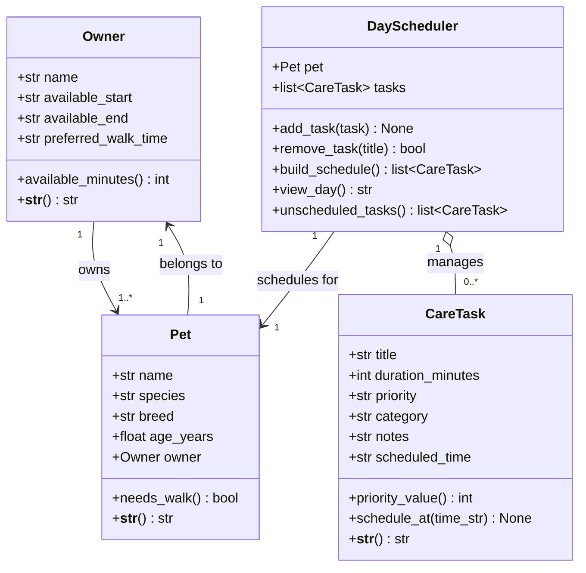

# PawPal+ Class Diagram

```mermaid
classDiagram
    class Owner {
        +str name
        +str available_start
        +str available_end
        +str preferred_walk_time
        +available_minutes() int
        +__str__() str
    }

    class Pet {
        +str name
        +str species
        +str breed
        +float age_years
        +Owner owner
        +needs_walk() bool
        +__str__() str
    }

    class CareTask {
        +str title
        +int duration_minutes
        +str priority
        +str category
        +str notes
        +str scheduled_time
        +priority_value() int
        +schedule_at(time_str) None
        +__str__() str
    }

    class DayScheduler {
        +Pet pet
        +list~CareTask~ tasks
        +add_task(task) None
        +remove_task(title) bool
        +build_schedule() list~CareTask~
        +view_day() str
        +unscheduled_tasks() list~CareTask~
    }

    Owner "1" --> "1..*" Pet : owns
    Pet "1" --> "1" Owner : belongs to
    DayScheduler "1" --> "1" Pet : schedules for
    DayScheduler "1" o-- "0..*" CareTask : manages
```
