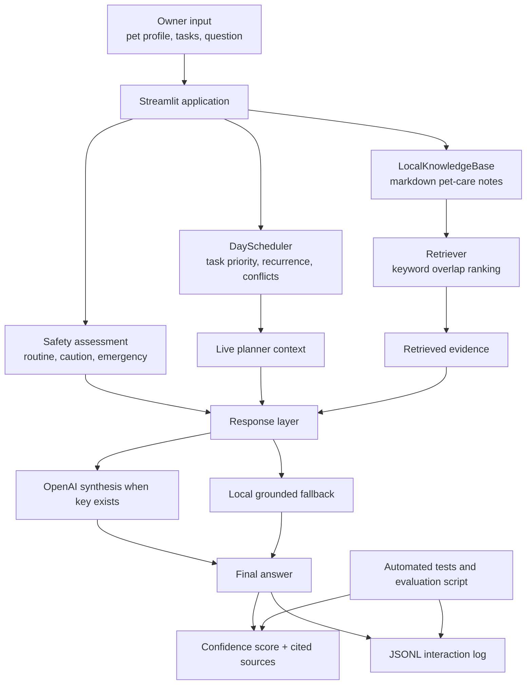

# PawPal+ Applied AI System Diagram

## Architecture Notes

- The original scheduling engine remains the core product workflow.
- Retrieval is local and deterministic, which makes testing and explanation easier.
- Safety assessment sits in front of generation so high-risk questions can be escalated before the assistant tries to sound helpful.
- The response layer can use OpenAI for better phrasing, but the system still runs without an API key.
